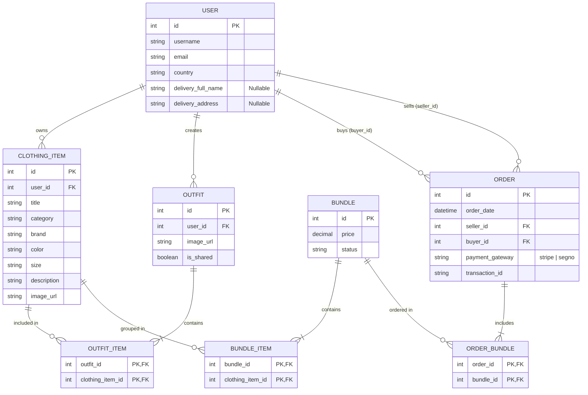

# ERD

```mermaid
erDiagram
    USER {
        int id PK
        string username
        string email
        string country
        string delivery_full_name "Nullable"
        string delivery_address "Nullable"
    }

    CLOTHING_ITEM {
        int id PK
        int user_id FK
        string title
        string category
        string brand
        string color
        string size
        string description
        string image_url
    }

    OUTFIT {
        int id PK
        int user_id FK
        string image_url
        boolean is_shared
    }

    OUTFIT_ITEM {
        int outfit_id PK, FK
        int clothing_item_id PK, FK
    }

    BUNDLE {
        int id PK
        decimal price
        string status
    }

    BUNDLE_ITEM {
        int bundle_id PK, FK
        int clothing_item_id PK, FK
    }

    ORDER {
        int id PK
        datetime order_date
        int seller_id FK
        int buyer_id FK
        string payment_gateway "stripe | segno"
        string transaction_id
    }

    ORDER_BUNDLE {
        int order_id PK, FK
        int bundle_id PK, FK
    }

    USER ||--o{ CLOTHING_ITEM : "owns"
    USER ||--o{ OUTFIT : "creates"
    USER ||--o{ ORDER : "buys (buyer_id)"
    USER ||--o{ ORDER : "sells (seller_id)"
    
    OUTFIT ||--|{ OUTFIT_ITEM : "contains"
    CLOTHING_ITEM ||--o{ OUTFIT_ITEM : "included in"

    BUNDLE ||--|{ BUNDLE_ITEM : "contains"
    CLOTHING_ITEM ||--o{ BUNDLE_ITEM : "grouped in"

    ORDER ||--|{ ORDER_BUNDLE : "includes"
    BUNDLE ||--o{ ORDER_BUNDLE : "ordered in"
```

NOTE: This is generated using my model with Google Gemini so it's still far from perfect. This will be modified.